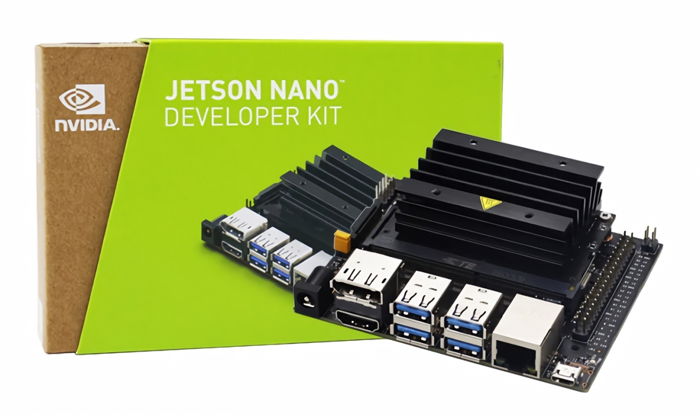

# 젯슨 나노 CUDA 환경 설정

## 1. 기존 OpenCV 제거
Jetson Nano에 이미 설치된 OpenCV를 제거하기 위해 다음 명령어를 실행합니다. 만약 시스템에 패키지 매니저를 통해 설치된 OpenCV가 있다면, 이를 제거해야 합니다.

```bash
sudo apt-get purge libopencv* python3-opencv
sudo apt-get autoremove
```

## 2. 작업 디렉토리 정리
이전에 OpenCV를 빌드했던 디렉토리와 관련 파일들을 정리합니다. 예를 들어, OpenCV 소스 코드가 있던 폴더를 삭제합니다.

```bash
rm -rf ~/opencv-4.x
rm -rf ~/opencv_contrib-4.x
```

## 3. 필요한 의존성 설치
OpenCV를 빌드하기 전에 필요한 의존성을 설치합니다. 이 단계는 OpenCV의 기능을 모두 지원하기 위해 다양한 라이브러리를 설치합니다.

```bash
sudo apt-get update
sudo apt-get install build-essential cmake unzip pkg-config
sudo apt-get install libjpeg-dev libpng-dev libtiff-dev
sudo apt-get install libavcodec-dev libavformat-dev libswscale-dev libv4l-dev
sudo apt-get install libxvidcore-dev libx264-dev
sudo apt-get install libgtk-3-dev
sudo apt-get install libatlas-base-dev gfortran
sudo apt-get install python3-dev
```

## 4. OpenCV 소스 코드 다운로드 및 빌드
OpenCV와 OpenCV Contrib 모듈의 최신 버전을 다운로드하고 빌드합니다.

```bash
wget -O opencv.zip https://github.com/opencv/opencv/archive/4.x.zip
wget -O opencv_contrib.zip https://github.com/opencv/opencv_contrib/archive/4.x.zip
unzip opencv.zip
unzip opencv_contrib.zip
cd opencv-4.x/
mkdir build
cd build
```

## 5. CMake를 사용한 OpenCV 구성
CMake를 사용하여 OpenCV를 CUDA와 함께 빌드하도록 구성합니다. 주의할 점은 모든 경로가 정확하고, CUDA 관련 옵션을 올바르게 설정하는 것입니다.

```bash
cmake -D CMAKE_BUILD_TYPE=RELEASE \
  -D CMAKE_INSTALL_PREFIX=/usr/local \
  -D INSTALL_PYTHON_EXAMPLES=ON \
  -D OPENCV_EXTRA_MODULES_PATH=~/opencv_contrib-4.x/modules \
  -D ENABLE_NEON=ON \
  -D ENABLE_VFPV3=ON \
  -D BUILD_TESTS=OFF \
  -D WITH_CUDA=ON \
  -D CUDA_ARCH_BIN="5.3" \
  -D CUDA_ARCH_PTX="" \
  -D WITH_CUBLAS=ON \
  -D WITH_LIBV4L=ON \
  -D BUILD_opencv_python3=TRUE \
  -D BUILD_opencv_python2=OFF \
  -D BUILD_EXAMPLES=ON ..
```
## 6. 빌드 및 설치

```bash
make -j$(nproc) # 1~2시간 정도 소요됩니다.
sudo make install
sudo ldconfig
```

## 7. 설치 확인
Python에서 OpenCV가 올바르게 설치되었는지 확인합니다.

```bash
import cv2
print(cv2.__version__)
print(cv2.cuda.getCudaEnabledDeviceCount())
```

## VFPV3 관련 오류 발생 시 해결 방법

### CMakeLists.txt 파일 열기
OpenCV 소스 디렉토리 내 CMakeLists.txt 파일을 열어서 수정합니다.

```bash
nano ~/opencv-4.x/CMakeLists.txt
```

### VFPV3 관련 내용 검색
파일 내에서 VFPV3 키워드를 검색합니다 (Ctrl+W in nano to search). VFPV3과 관련된 기능을 삭제하거나 주석 처리합니다.

```bash
# ex)
if(ANDROID)
  if(ANDROID_ABI MATCHES "NEON")
    set(ENABLE_NEON ON)
  endif()
  if(ANDROID_ABI MATCHES "VFPV3")
    # set(ENABLE_VFPV3 ON)  <-- 이 부분을 주석 처리합니다.
  endif()
endif()
```

### 변경 사항 저장 및 종료
모든 변경 사항을 저장하고 파일 에디터를 종료합니다 (Ctrl+X, Y to confirm, and Enter in nano).

### CMake 다시 실행
OpenCV 빌드 디렉토리로 돌아가서 CMake를 다시 실행합니다. 변경사항이 반영되도록 모든 CMake 캐시를 클리어하는 것이 좋습니다.

```bash
cd ~/opencv-4.x/build
rm -rf *  # CMake 캐시와 기존 빌드 파일들을 클리어
cmake -D CMAKE_BUILD_TYPE=RELEASE \
  -D CMAKE_INSTALL_PREFIX=/usr/local \
  -D INSTALL_PYTHON_EXAMPLES=ON \
  -D OPENCV_EXTRA_MODULES_PATH=~/opencv_contrib-4.x/modules \
  -D ENABLE_NEON=ON \
  -D BUILD_TESTS=OFF \
  -D WITH_CUDA=ON \
  -D CUDA_ARCH_BIN="5.3" \
  -D CUDA_ARCH_PTX="" \
  -D WITH_CUBLAS=ON \
  -D WITH_LIBV4L=ON \
  -D WITH_OPENCL=OFF \
  -D BUILD_opencv_python3=TRUE \
  -D BUILD_opencv_python2=OFF \
  -D BUILD_EXAMPLES=ON \
  -D CPU_BASELINE=NEON ..
```

### 빌드 시작
OpenCV 빌드 디렉토리에서 make 명령을 사용하여 빌드 프로세스를 시작합니다. 여러 코어를 사용하여 빌드 시간을 단축시킬 수 있습니다. 예를 들어, 4개의 코어를 사용하는 경우 -j4 옵션을 사용할 수 있습니다.

```bash
make -j$(nproc)  # 사용 가능한 모든 코어를 이용하여 빌드
```

### 빌드 과정 모니터링
빌드 과정은 시스템의 성능에 따라 몇 분에서 몇 시간까지 걸릴 수 있습니다. 중간에 에러가 없는지 주의 깊게 모니터링하세요.

### 설치
빌드가 성공적으로 완료되면, 다음 명령을 사용하여 시스템에 OpenCV를 설치합니다.

```bash
sudo make install
```

### 라이브러리 링크 업데이트
설치 후에는 시스템 라이브러리 링크를 업데이트하여, OpenCV 라이브러리를 시스템에서 쉽게 찾을 수 있도록 해야 합니다.

```bash
sudo ldconfig
```

### 설치 확인
Python 등을 통해 설치가 제대로 되었는지 확인합니다. Python 셸을 열고 다음과 같이 입력하여 OpenCV 버전을 확인할 수 있습니다.

```bash
import cv2
print(cv2.__version__)
```

### CUDA 활성화 확인
이 명령은 설치된 OpenCV의 버전을 출력합니다. 또한, CUDA가 활성화되었는지 확인하려면 다음을 사용할 수 있습니다.

```bash
print(cv2.cuda.getCudaEnabledDeviceCount())
```


